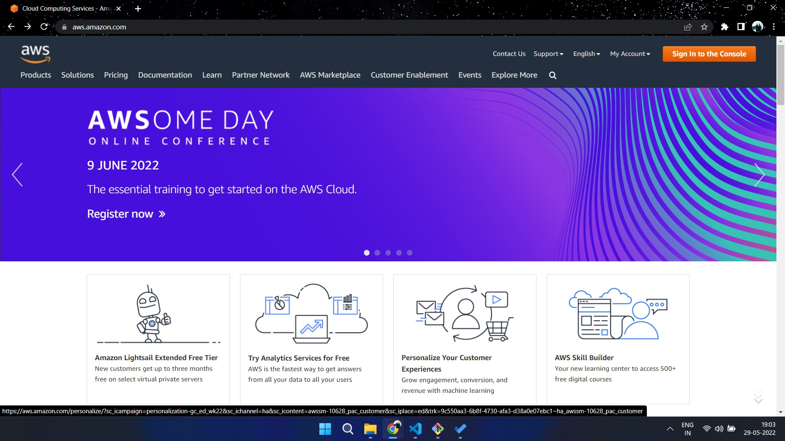
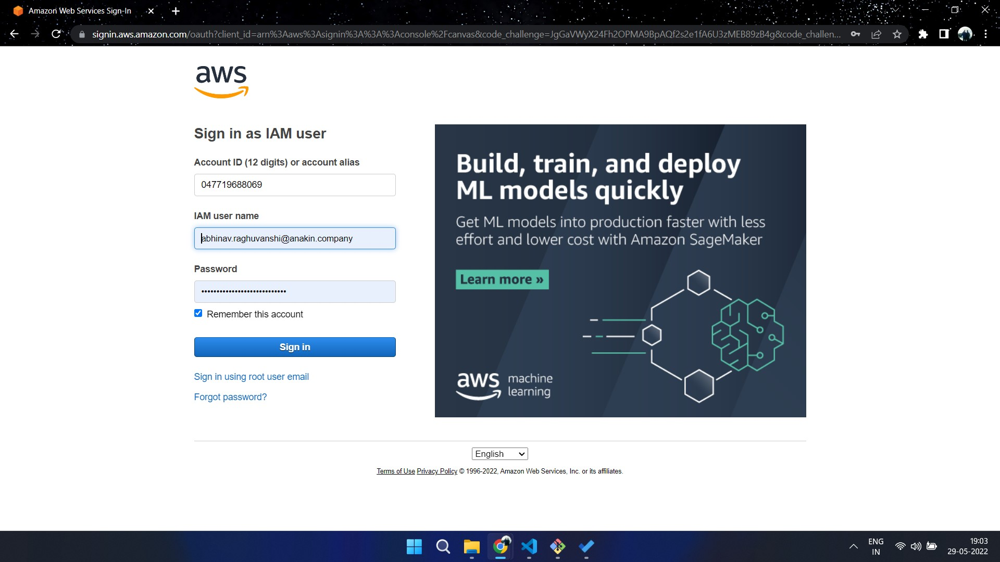
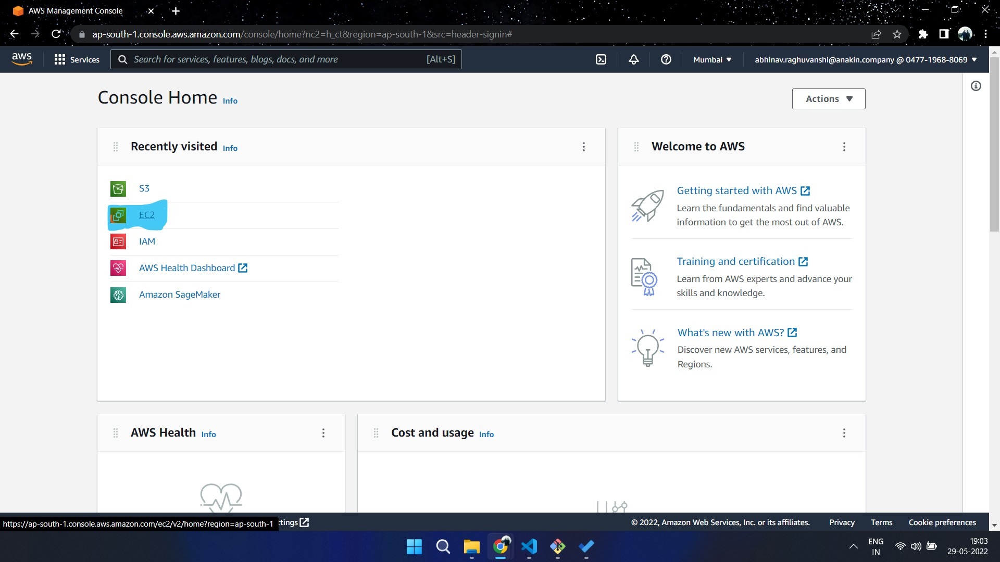
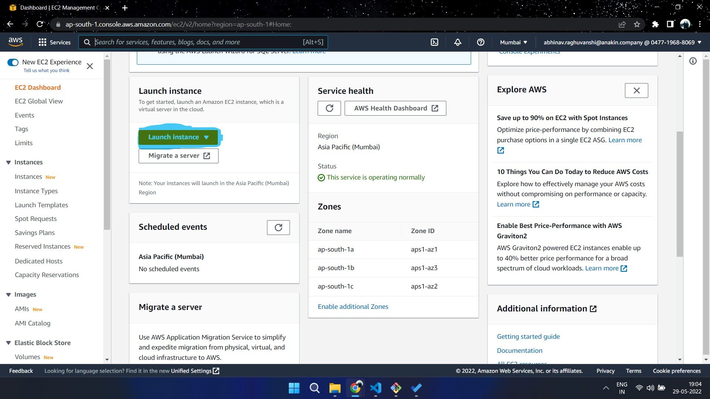
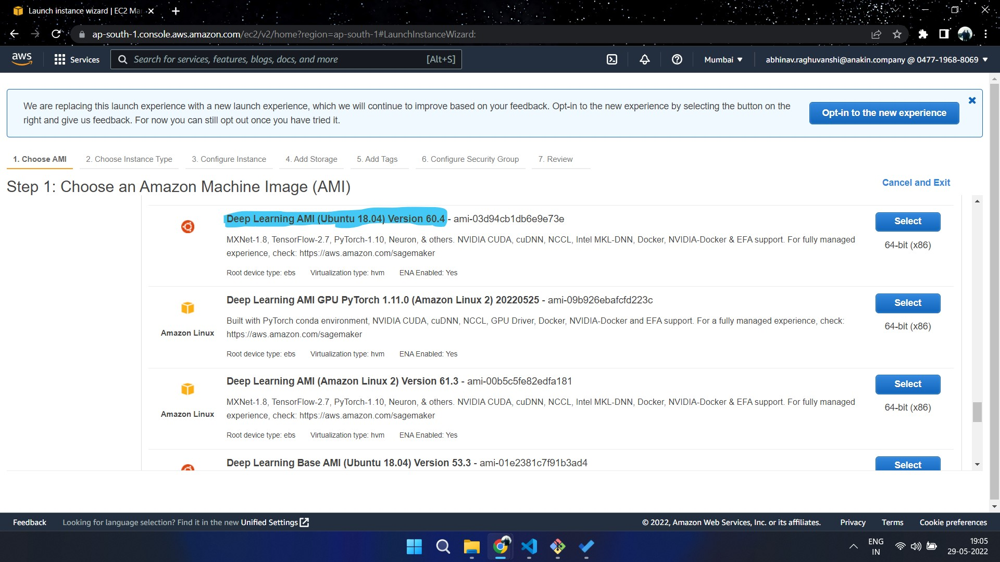
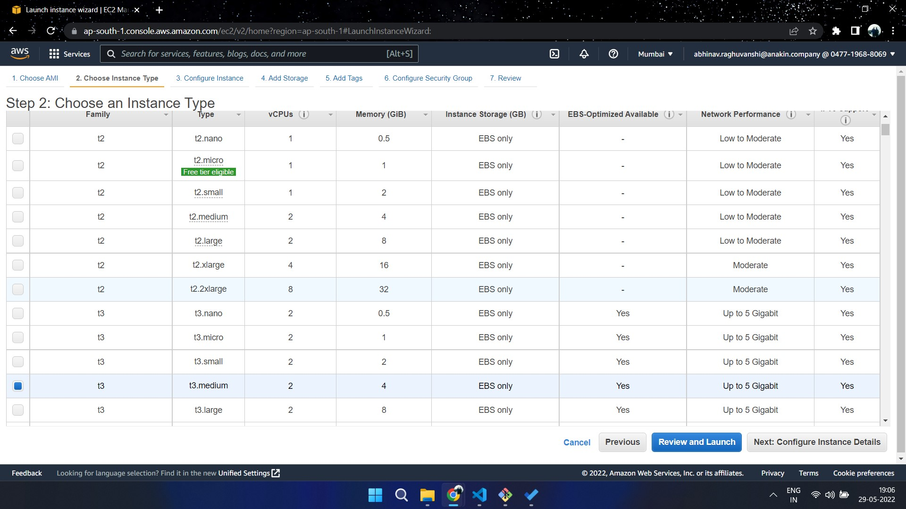

# How to Host the models on AWS
### Step 1
Make a AWS account 

### Step 2
Sign in to the console

### Step 3
Go to EC2 , you can either locate EC2 directly or search for it on the search bar at the top

### Step 4
Hit `launch instance` to launch a virtual machine 

### Step 5
Next choose a machine , I would recommend to use ubuntu but be mindful of the fact *that it's not for free use and it will cost you money to run this instance*  

### Step 6
Each tier has its own rate so you'll be charged as per the tier you choose , for now I would say `t3 medium` should work well. Select that and hit `review and launch`

### Step 7
Check and see if everything is as per your selection and then hit `launch`
### Step 8
You'll be asked if you want to get a new key for your instance , select that if you want a new key . Or choose from existing if you already have made a key previously.
### Step 9 
Launch the instance from VSCode or Putty whatever you want to use to connect to an instance . Don't worry if you haven't done this before take a look at this tutorial [here](https://medium.com/@christyjacob4/using-vscode-remotely-on-an-ec2-instance-7822c4032cff) 

### Step 10
After launching the instance terminal do ->
1. `sudo apt update`
2. `sudo apt install python3-pip`
3. `git clone https://github.com/abhinavr11/engage22.git`
4. `cd engage22/hosting`
5. `pip install -r requirements.txt`
6. `cd bodyFat`
7. `python3 app.py`
8. Similarly follow step 6 & 7 for gazeTracker and faceDetection 
You will see that all the models that were not there will get downloaded automatically from drive . Also the apps are now hosted and connected to an endpoint API using Flask and you can see the API Url on the terminal from where we can access those models.